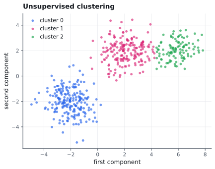
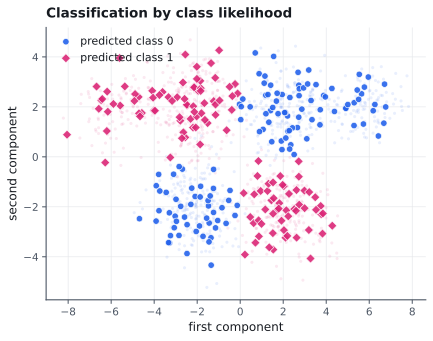

============
Demo Details
============

Two demo scripts in the repository show the main uses of the package:
``demo/demo_1.py`` and ``demo/demo_2.py``.

Demo 1: unsupervised clustering
-------------------------------

``demo/demo_1.py`` estimates the order and parameters of a Gaussian mixture, then
labels each point by its most-likely cluster.

Steps:

1. Draw 500 points from a Gaussian mixture with 3 clusters.
2. Call ``GMModel.estimate(X, num_clusters="auto")`` on the points.  The estimation
   recovers the number of clusters and their parameters.
3. Call ``classify`` to label each point by its most-likely cluster.

   Left: the generated samples.  Right: the clusters found by the estimation.

Demo 2: classification by log density
-------------------------------------

``demo/demo_2.py`` estimates one mixture per class and classifies test points by
maximum likelihood.

Steps:

1. Draw data from 2 Gaussian mixtures, each with 3 clusters: a training set from
   each mixture, plus a combined test set.
2. Call ``GMModel.estimate(X, num_clusters="auto")`` on each training set, giving one
   model per class.
3. Call ``log_density`` from each model on the test set, and label each test
   point by the class whose model gives the higher value.

   Left: the training samples for the two classes.  Right: the test points
   labeled by the class with the higher log-likelihood.
