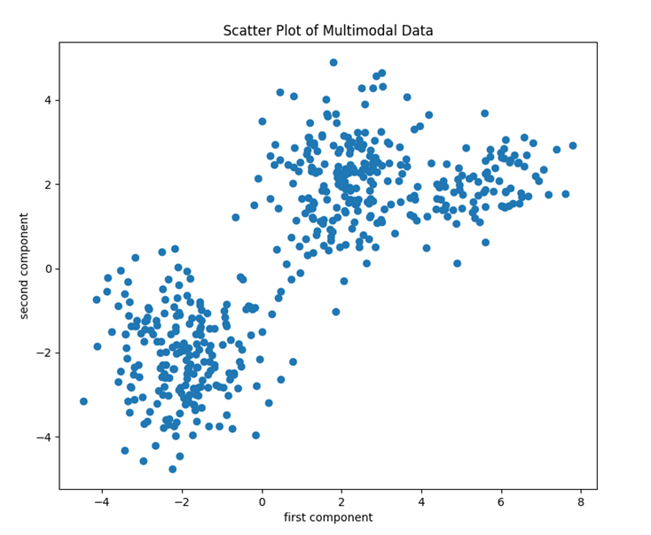
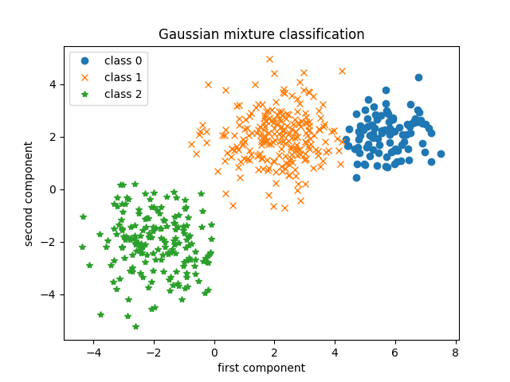
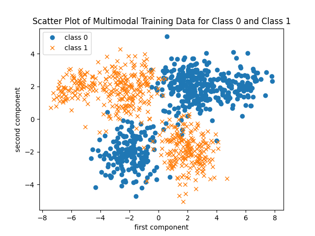
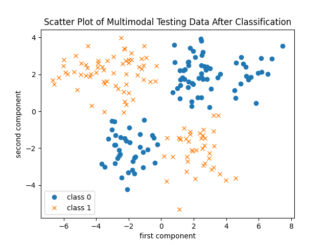

============
Demo Details 
============

The repository contains demo python scripts named **demo/demo_1.py** and **demo/demo_2.py** that demonstrate two different uses of the software package. 

Demo 1
------

The demo shows EM algorithm-based cluster parameter and order estimation for a Gaussian mixture model, followed by unsupervised classification of data points from different clusters.

**Steps**
	• First, generate 500 observations from a Gaussian mixture model with 3 clusters.
	• Then fit a ``GaussianMixture(num_clusters="auto")`` model to the data, which estimates the order and the cluster parameters.
	• Then call ``classify`` on the data to label each observation by its most-likely cluster.

**Results**

   
   Generated samples
   

   
   Unsupervised classification results
   
   
Demo 2
------

The demo uses the EM algorithm to estimate the orders and parameters of 2 different Gaussian mixture models and perform binary maximum-likelihood classification.

**Steps**
	• First, generate data from 2 Gaussian mixture models, each with 3 clusters. The generated data includes a training dataset from each mixture and a combined testing dataset.
	• Then fit a ``GaussianMixture(num_clusters="auto")`` model to each training dataset.
	• Finally, call ``log_likelihood`` from each fitted model on the testing dataset, and label each test point by the class with the higher log-likelihood.
    
**Results**

   
   Training samples
   

   
   Classification results

