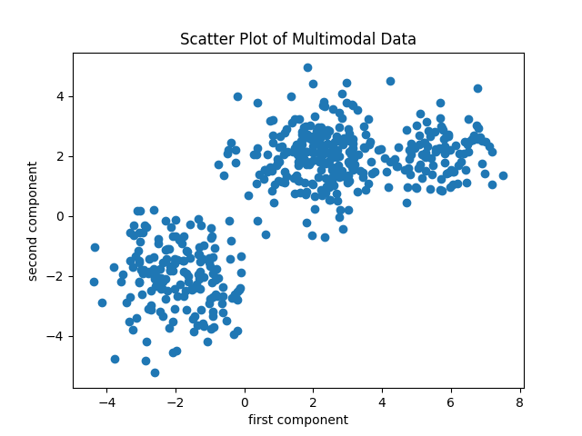

============
Demo Details 
============

We have 2 demo scripts showing different uses of the software package.

Demo 1
------

The demo shows an implementation of EM algorithm-based cluster parameter and order estimation for Gaussian mixture model followed by unsupervised classification of datapoints from different clusters.

**Steps**
	• First, generate 500 observations from a Gaussian mixture model with 3 clusters.
	• Then implement “estimate_gm_params” function on the data for the estimation.
	• Then use “split_classes” followed by “compute_class_likelihood” functions to classify observations from different clusters.

**Results**

   
   Generated samples
   

   
   Unsupervised classification results
   
   
Demo 2
------

The demo shows an implementation of the EM algorithm to estimate the orders and parameters of 2 different Gaussian Mixture models and perform binary maximum likelihood classification.

**Steps**
	• First, generate data from 2 Gaussian mixture model each with 3 clusters. The generated data includes training dataset from both mixtures and a combined testing dataset.
	• Then implement “estimate_gm_params” function on both the training datasets for the estimation.
	• Finally, use “compute_class_likelihood” function to get the likelihood value to classify testing dataset.
    
**Results**

   
   Training samples
   

   
   Classification results

