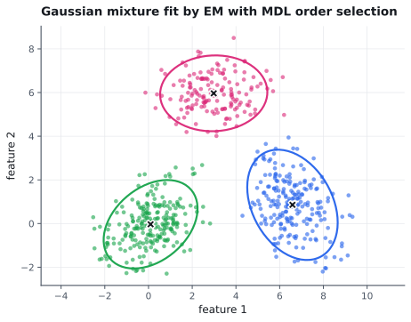

.. gmcluster documentation master file.
   You can adapt this file completely to your liking, but it should at least
   contain the root `toctree` directive.

gmcluster: Gaussian mixture clustering
======================================

**gmcluster** estimates the parameters of a Gaussian mixture model from sample
data, and picks the number of clusters for you.

**Key features:**

* Estimates the number of clusters automatically by minimum description length (MDL), so you do not have to guess K.
* One-line ``estimate`` on your data, then ``classify``, ``posterior``, ``log_density``, or ``sample``.
* Full or diagonal cluster covariances.
* Optional coordinate whitening to better condition the problem.
* Models overlapping clusters with an EM Gaussian mixture, not hard k-means.
* Pure NumPy, with no compiled dependencies.
* A modern Python rewrite of Bouman's classic *Cluster* C program.

.. grid:: 3
   :margin: 0
   :padding: 0
   :gutter: 0

   .. grid-item-card:: Choose K automatically
      :columns: 12 6 6 4
      :class-card: sd-border-0
      :shadow: None

      MDL selects the number of clusters that best fits the data.

   .. grid-item-card:: Overlapping clusters
      :columns: 12 6 6 4
      :class-card: sd-border-0
      :shadow: None

      An EM Gaussian mixture separates clusters even when they overlap.

   .. grid-item-card:: Pure NumPy
      :columns: 12 6 6 4
      :class-card: sd-border-0
      :shadow: None

      No compiled dependencies; installs and runs anywhere NumPy does.

.. grid:: 2

   .. grid-item-card:: :material-regular:`description;2em` Overview
      :class-card: gmc-nav
      :columns: 12 6 6 6
      :link: overview
      :link-type: doc

      What gmcluster does.

   .. grid-item-card:: :material-regular:`rocket_launch;2em` Installation
      :class-card: gmc-nav
      :columns: 12 6 6 6
      :link: install
      :link-type: doc

      Install from source and run a demo.

   .. grid-item-card:: :material-regular:`menu_book;2em` API
      :class-card: gmc-nav
      :columns: 12 6 6 6
      :link: api
      :link-type: doc

      The ``GMModel`` class and its methods.

   .. grid-item-card:: :material-regular:`science;2em` Demos
      :class-card: gmc-nav
      :columns: 12 6 6 6
      :link: demo_details
      :link-type: doc

      Worked examples on synthetic data.

.. toctree::
   :hidden:
   :maxdepth: 4
   :caption: Background

   overview
   theory
   credits

.. toctree::
   :hidden:
   :maxdepth: 4
   :caption: User Guide

   install
   api
   demo_details

.. toctree::
   :hidden:
   :maxdepth: 4
   :caption: Developer Guide

   dev_release
   docs
