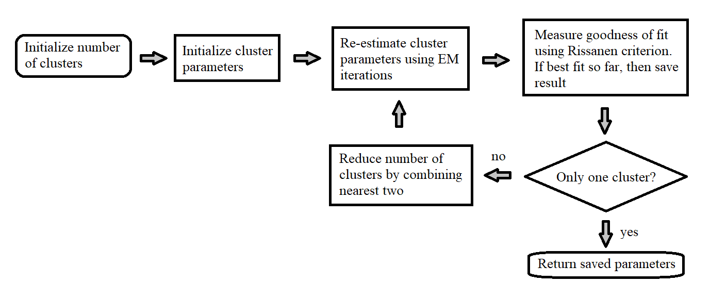

========
Overview 
========

PyGMCluster is a python-based software package that automatically estimates the parameters of a Gaussian mixture model from sample data. This process is essentially similar to conventional clustering except that it allows cluster parameters to be accurately estimated even when the clusters overlap substantially. The resulting mixture model is useful for a variety of applications including texture and multispectral image segmentation.

The "gaussian_mixture" function applies the expectation-maximization (EM) algorithm together with an agglomerative clustering strategy to estimate the number of clusters that best fit the data. The estimation is based on the Rissenen order identification criteria known as minimum description length (MDL). This is equivalent to maximum-likelihood (ML) estimation when the number of clusters is fixed, but in addition, it allows the number of clusters to be accurately estimated. The function includes an option to decorrelate coordinates to better condition the problem.

The package also includes two additional functions which make "gaussian_mixture" more useful. The function "GM_class_likelihood" can be used to perform maximum likelihood classification from the parameter estimation generated by "gaussian_mixture", and the function "split_classes" can be used along with "gaussian_mixture" and "GM_class_likelihood" to perform unsupervised classification.

**How does the "gaussian_mixture" function work?**

The algorithm starts with initializing a set of cluster parameters for a user-selected number of clusters. The cluster means are generated by selecting the appropriate number of samples from the training data, and the cluster covariances are all set equal to the covariance of the complete data set. After this initialization, the algorithm performs multiple iterations of EM clustering until converged cluster parameters are estimated for the given number of clusters. For each iteration of EM clustering, the algorithm performs an E-step and an M-step. Then the algorithm enters a loop in which clusters are combined (or eliminated when empty) to reduce the order. For every reduced order, we again perform EM clustering to get the cluster parameters. Based on Rissanen criterion, the algorithm finally makes the decision on optimal order and associated cluster parameters (unless the optimal order is fixed by the user). The following figure illustrates the basic operations performed in the "gaussian_mixture" function.

   
   "gaussian_mixture" function operation flowchart

