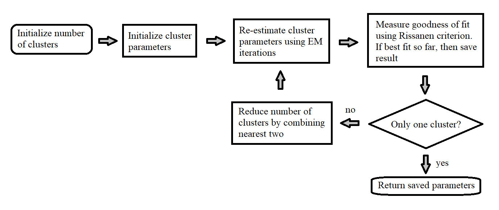

========
Overview
========

**gmcluster** is a python-based software package that automatically estimates the parameters of a Gaussian mixture model from sample data. This process is essentially similar to conventional clustering except that it allows cluster parameters to be accurately estimated even when the clusters overlap substantially. The resulting mixture model is useful for a variety of applications including texture and multispectral image segmentation.

The package provides one class, **GaussianMixture**. You create a model with the settings you want, then call **fit(X)** on your data. The **fit** method applies the expectation-maximization (EM) algorithm together with an agglomerative clustering strategy to estimate the number of clusters that best fit the data. The estimation is based on the Rissanen order identification criterion known as minimum description length (MDL). This is equivalent to maximum-likelihood (ML) estimation when the number of clusters is fixed, but in addition, it allows the number of clusters to be accurately estimated. Set ``num_clusters="auto"`` to select the number of clusters by MDL, or pass a positive integer to fix it. The ``whiten`` setting decorrelates the coordinates before clustering to better condition the problem.

A naming note: the constructor arguments are settings you request. The values produced by **fit** are estimates, so they are stored under names that start with ``estimated_``. An estimator is a random variable; each fitted array is one realization of it.

After **fit**, the results are stored on the model:

* ``estimated_num_clusters`` — the number of clusters in the fitted model.
* ``estimated_weights`` — the cluster weights, shape ``(K,)``.
* ``estimated_means`` — the cluster means, shape ``(K, M)``.
* ``estimated_covariances`` — the cluster covariance matrices, shape ``(K, M, M)``.
* ``mdl`` — the MDL value of the fitted model.
* ``mdl_path`` — the ``(K, MDL)`` pairs for every order visited during the search.
* ``converged``, ``num_iterations`` — diagnostics from the fit.

The fitted model also provides several methods:

* **classify(X)** returns the most-likely cluster index for each point, shape ``(N,)``.
* **posterior(X)** returns ``P(cluster | x)`` for each point, shape ``(N, K)``, with rows that sum to 1.
* **log_likelihood(X)** returns the per-point log density ``log p(x)``, shape ``(N,)``. This can be used to perform tasks such as maximum-likelihood classification: fit one model per class, then label each point by the class with the higher log-likelihood.
* **sample(num_samples, rng, with_labels)** draws samples from the fitted mixture, which simulates data from a Gaussian mixture model of any order.
* **split_clusters()** returns a list of single-cluster models, one per component of the fitted mixture. It is kept for use alongside other segmentation packages.

**How does the fit method work?**

The algorithm starts by initializing a set of cluster parameters for a chosen number of clusters. The cluster means are generated by selecting the appropriate number of samples from the training data, and the cluster covariances are all set equal to the covariance of the complete data set. After this initialization, the algorithm performs multiple iterations of EM clustering until converged cluster parameters are estimated for the given number of clusters. For each iteration of EM clustering, the algorithm performs an E-step and an M-step. Then the algorithm enters a loop in which clusters are combined (or eliminated when empty) to reduce the order. For every reduced order, EM clustering is run again to get the cluster parameters. Based on the Rissanen criterion, the algorithm finally makes the decision on the optimal order and its associated cluster parameters (unless the optimal order is fixed by the user). The following figure illustrates the basic operations performed by **fit**.

   Operation flowchart for the fit method
