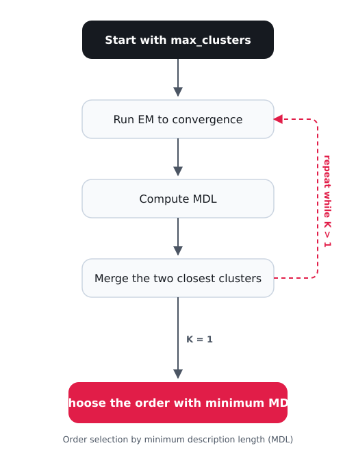

========
Overview
========

**gmcluster** fits a Gaussian mixture model to sample data and chooses how many
clusters to use automatically.  It handles clusters that overlap heavily, where
simple clustering fails.  Typical uses are texture and multispectral image
segmentation, density estimation, and classification.

The package provides one class, :class:`~gmcluster.GMModel`.  Estimate a model from
your data, then read its parameters or classify new points::

    from gmcluster import GMModel

    model = GMModel.estimate(X, num_clusters="auto")   # X is (num_points, num_features)

    print(model.num_components)                        # number of clusters found
    print(model.means)                                 # cluster centers, (K, M)

    labels = model.classify(X_new)                     # most-likely cluster per point
    samples = model.sample(1000)                       # draw new points from the model

Key ideas
---------

* **Automatic order selection.**  Set ``num_clusters="auto"`` and the estimation
  chooses the number of clusters by the minimum description length (MDL) criterion.
  Pass a positive integer to fix the number instead.
* **Handles overlap.**  The estimation uses the expectation-maximization (EM)
  algorithm, which assigns each point a soft membership to every cluster, so
  clusters that overlap are still estimated accurately.
* **Full or diagonal covariances.**  ``covariance_type="full"`` allows tilted,
  correlated clusters; ``"diagonal"`` restricts each cluster to axis-aligned spread
  and uses fewer parameters.
* **Optional whitening.**  ``whiten=True`` decorrelates and scales the coordinates
  before clustering, which conditions the problem when the input features are on
  very different scales.

Estimating a model and reading its parameters
---------------------------------------------

Estimate a model from data with the classmethod
:meth:`GMModel.estimate(X, num_clusters="auto", max_clusters=20, covariance_type="full", alpha=0.1, whiten=False, verbose=False, return_info=False) <gmcluster.GMModel.estimate>`.
It returns a :class:`~gmcluster.GMModel`.  You can also build a model directly from
parameters you choose with ``GMModel(weights, means, covariances)``.

A model holds its parameters in read-only properties:

* ``weights`` — cluster weights, shape ``(K,)``.
* ``means`` — cluster means, shape ``(K, M)``.
* ``covariances`` — cluster covariance matrices, shape ``(K, M, M)``.
* ``num_components`` — number of clusters, ``K``.
* ``num_features`` — number of features, ``M``.

Call ``set_parameters(weights, means, covariances)`` to replace the parameters in
place.

Pass ``return_info=True`` to ``estimate`` to also receive an
:class:`~gmcluster.EstimationInfo` record that describes the estimation:
``num_clusters`` (the order chosen), ``mdl`` (the description length at that order),
``mdl_path`` (the ``(K, MDL)`` pairs for every order visited), ``converged``, and
``num_iterations``.

A model provides these methods:

* ``classify(X)`` — most-likely cluster index for each point, shape ``(N,)``.
* ``posterior(X)`` — ``P(cluster | x)`` for each point, shape ``(N, K)``, rows sum to 1.
* ``log_density(X)`` — per-point log density ``log p(x)``, shape ``(N,)``.  Estimate one
  model per class and label each point by the class with the higher value to do
  maximum-likelihood classification.
* ``sample(num_samples, rng, with_labels)`` — draw points from the mixture.
* ``split()`` — return one single-cluster model per component, for use with other
  segmentation packages.

How order selection works
--------------------------

With ``num_clusters="auto"``, the estimation searches over the number of clusters:

1. Start at ``max_clusters``.  Set the means to points drawn from the data and set
   every covariance to the covariance of the whole data set.
2. Run EM to convergence, then compute the MDL value for that number of clusters.
3. Merge the two closest clusters, reducing the count by one.
4. Repeat steps 2 and 3 down to one cluster.
5. Keep the number of clusters, and the parameters, with the smallest MDL value.

MDL balances fit against model size: adding clusters always fits the data better,
so MDL adds a penalty that grows with the number of parameters.  The minimum is the
order that describes the data in the fewest bits.  See :doc:`theory` for the
derivation.

   Order selection during estimation.
